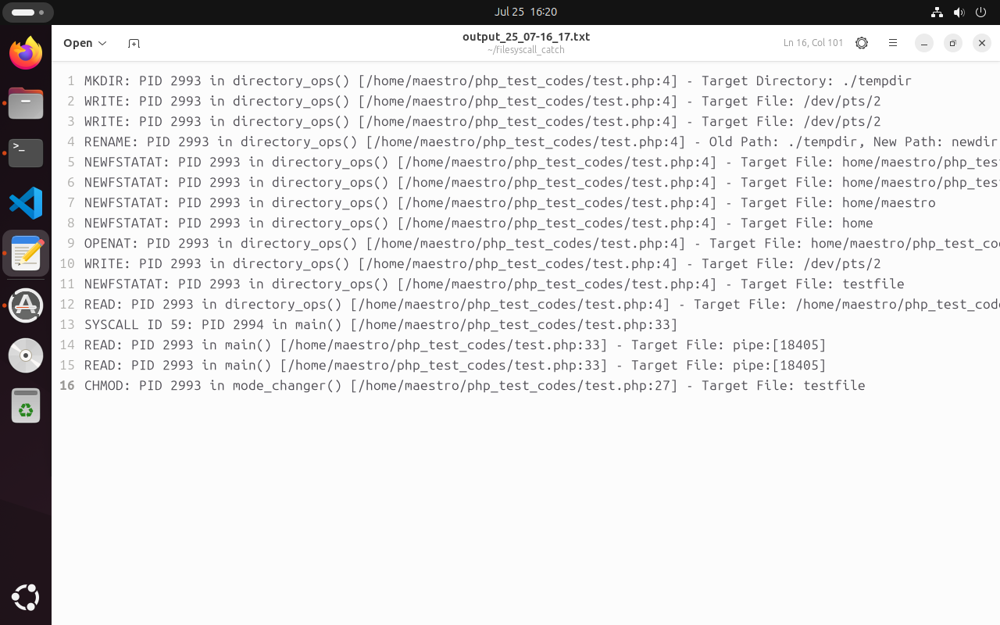

# filesyscall_catch

filesyscall_catch is a tool that monitors filesystem related syscalls of the PHP applications in the runtime. It uses eBPF (extended Berkeley Packet Filter) technology. For detailed explanation of how the tool works, visit [here](https://medium.com/@psy_maestro/ebpf-based-linux-filesystem-syscall-runtime-monitoring-8e5a49ff82d9).

It traces `read`, `write`, `newfstatat`, `mkdir`, `mkdirat`, `unlinkat`, `open`, `openat`, `openat2`, `chmod`, `fchmod`, `fchmodat`, `rename` syscalls and figures out which PHP file, function and line number calls them. It creates a file in the currently working directory named output_{day}\_{month}\_{hour}_{minute}.txt and the output is like the following:

## Build and Running Commands
- make install
- filesyscall_catch

## Notes
- If you want to use this tool, you may want to run the following command since the output file depends on the kernel version: `bpftool btf dump file /sys/kernel/btf/vmlinux format c > ebpf/vmlinux.h`
- 
